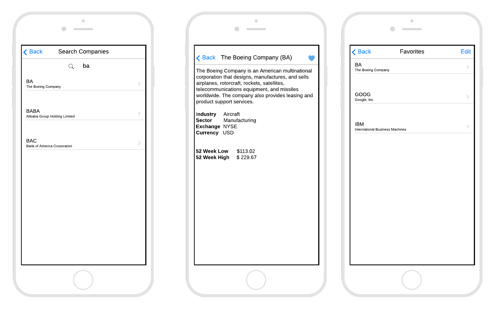

# Project Shape Up
## Problem
Many of our customers are first-time investors who have yet to learn about the companies that build out their portfolios. For example, investors may be unfamiliar with a company named Darden. However, they regularly purchase meals at restaurants like Olive Garden, Capital Grille, and Longhorn, all brands of the Darden Group.  

## Solution
To help customers learn more about the various companies, we've decided to invest in developing a companion app that enables consumers to search for publicly traded companies and retrieve details about these companies. Once a user finds a company of interest, they should be able to add it to their "favorites" list, where they can access it at any point. Users should also be able to remove companies from their favorites.

## Rabbit Holes
1. There is a lot of information that we could show to users, but at a minimum, we will keep it to the subset of data shown in the screenshots above.
2. We don't have Pixel-perfect designs, so developers are encouraged to use their best judgment concerning design.
3. The application isn't overly complicated; however, we need to have some state management between screens.
4. We don't require a heavy-duty datastore; however, we should consider being able to persist a user's favorites between app restarts. 

## No-gos
1. This app is intended for informational purposes only, and we will not be purchasing stocks or providing customers with specific advice on what stocks to purchase.
2. We do not need to consider designs for Android and iOS at the moment, and focusing on iOS users is sufficient for this MVP.
3. We don't need to consider multiple users; therefore, we do not require any user auth mechanism.